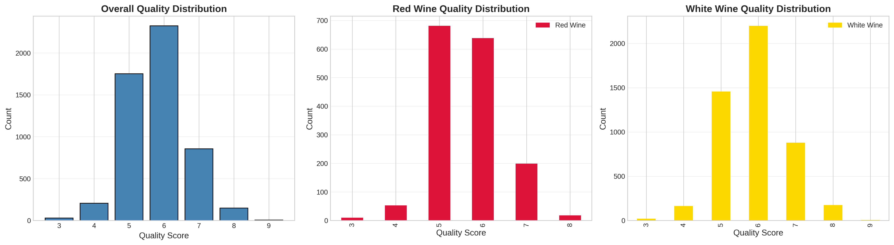
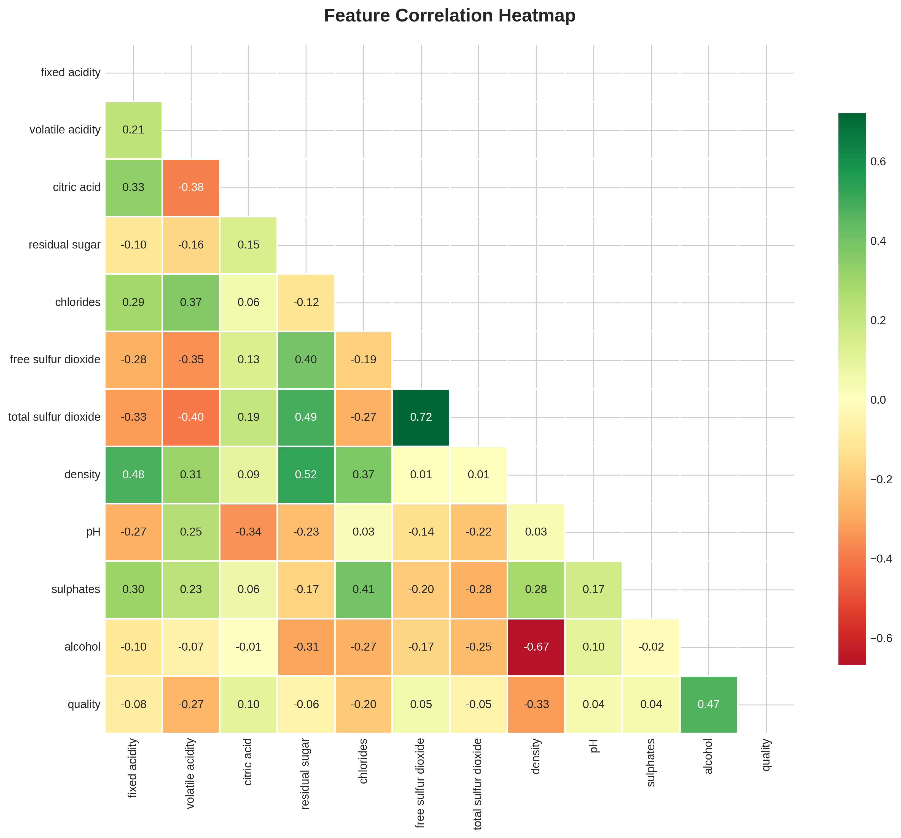
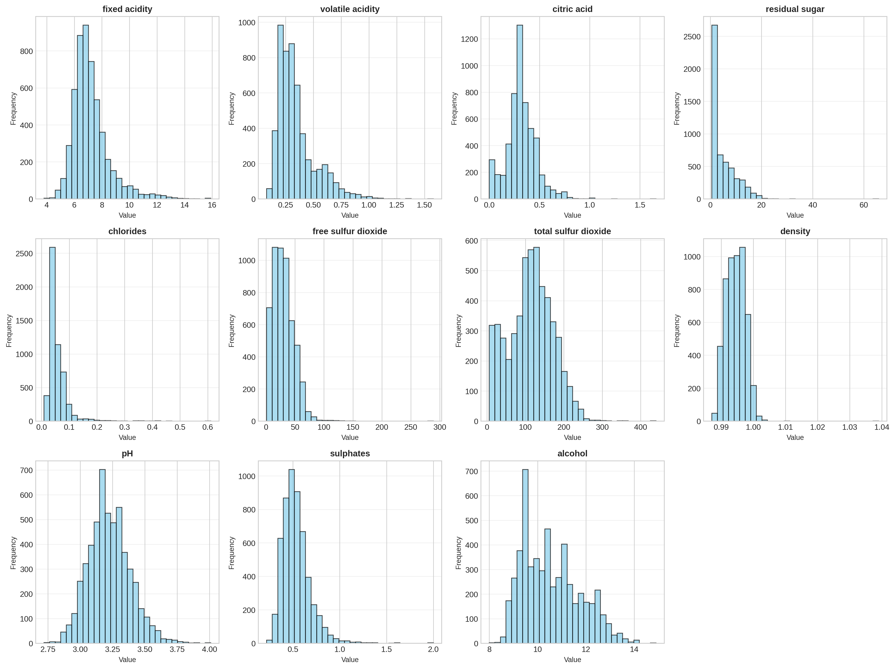
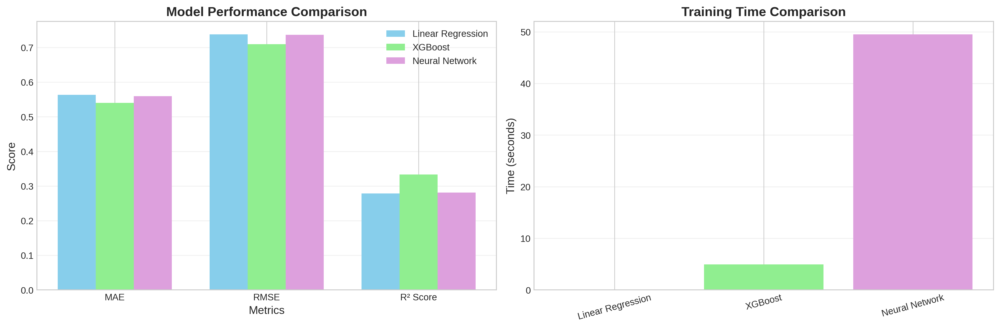
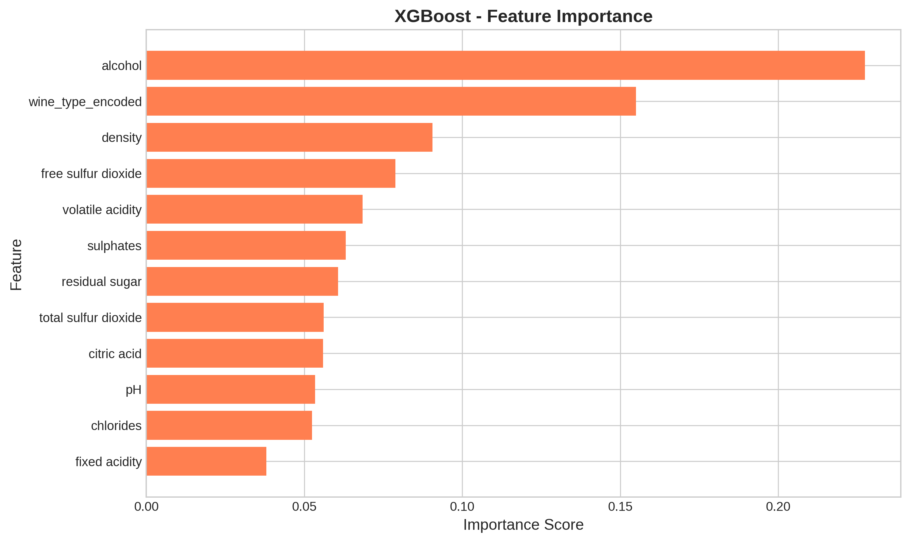

# LAPORAN PROYEK MACHINE LEARNING
## Wine Quality Prediction

---

## INFORMASI PROYEK

**Judul Proyek:** Prediksi Kualitas Wine Menggunakan Machine Learning dan Deep Learning

**Nama Mahasiswa:** Arisatya Abhirama  
**NIM:** 233307036  
**Program Studi:** Teknologi Informasi  
**Mata Kuliah:** Data Science  
**Dosen Pengampu:** Gus Nanang  
**Tahun Akademik:** 2025/Semester 5  
**Link GitHub Repository:** [https://github.com/ari2b/UAS-WINE-QUALITY]  
**Link Video Pembahasan:** [https://drive.google.com/drive/u/0/folders/1fMAUyLtZCl64iZX9KYtwHPVfhEYGo8VH]

---

## 1. LEARNING OUTCOMES

Pada proyek ini, saya telah berhasil:
1. Merumuskan problem statement untuk prediksi kualitas wine (regression task)
2. Melakukan EDA untuk memahami distribusi data red dan white wine
3. Melakukan data preparation dengan handling outliers dan feature engineering
4. Mengembangkan 3 model: Linear Regression (baseline), XGBoost (advanced), dan Neural Network (deep learning)
5. Menggunakan metrik evaluasi regression: MAE, RMSE, R² Score
6. Melaporkan hasil eksperimen secara sistematis
7. Mengunggah kode ke GitHub dengan struktur yang terorganisir
8. Menerapkan prinsip reproducibility dalam pengembangan

---

## 2. PROJECT OVERVIEW

### 2.1 Latar Belakang

Kualitas wine merupakan faktor kritis yang menentukan harga dan kepuasan konsumen di industri wine. Penilaian kualitas wine secara tradisional dilakukan oleh wine experts melalui sensory evaluation, yang memakan waktu, mahal, dan subjektif. Dengan memanfaatkan machine learning, kita dapat memprediksi kualitas wine berdasarkan properti physicochemical yang objektif dan terukur.

Dataset Wine Quality dari UCI Machine Learning Repository menyediakan data red dan white Portuguese "Vinho Verde" wine dengan 11 fitur physicochemical yang dapat digunakan untuk memprediksi quality score (0-10).

Proyek ini penting untuk:
- Memberikan alternatif cost-effective untuk quality assessment
- Membantu wine producers dalam quality control sebelum produk dirilis
- Mengidentifikasi faktor-faktor yang paling berpengaruh terhadap kualitas wine
- Membandingkan efektivitas model tradisional vs deep learning untuk regression task

**Referensi:**
> Cortez, P., Cerdeira, A., Almeida, F., Matos, T., & Reis, J. (2009). Modeling wine preferences by data mining from physicochemical properties. Decision Support Systems, 47(4), 547-553.

---

## 3. BUSINESS UNDERSTANDING

### 3.1 Problem Statements

1. Bagaimana cara memprediksi kualitas wine secara akurat berdasarkan 11 properti physicochemical?
2. Fitur apa yang paling berpengaruh terhadap kualitas wine?
3. Apakah ada perbedaan karakteristik antara red wine dan white wine yang mempengaruhi kualitas?
4. Model mana yang paling efektif untuk regression task pada wine quality prediction?

### 3.2 Goals

1. Membangun model prediksi kualitas wine dengan MAE < 0.6 dan R² > 0.35
2. Membandingkan performa 3 pendekatan: baseline (Linear Regression), advanced (XGBoost), dan deep learning (Neural Network)
3. Mengidentifikasi fitur-fitur yang paling berpengaruh dalam menentukan kualitas wine
4. Membuat sistem yang reproducible dengan dokumentasi lengkap untuk membantu wine producers

### 3.3 Solution Approach

#### Model 1 – Baseline: Linear Regression
Model ini dipilih sebagai baseline karena sederhana, cepat, dan mudah diinterpretasi. Linear Regression cocok untuk memahami hubungan linear antara fitur dan target variable.

#### Model 2 – Advanced: XGBoost Regressor
XGBoost merupakan gradient boosting algorithm yang powerful untuk regression tasks. Model ini robust terhadap outliers, dapat menangani non-linear relationships, dan memberikan feature importance analysis yang berguna untuk business insights.

#### Model 3 – Deep Learning: Neural Network (MLP)
Multilayer Perceptron Regressor dipilih untuk mempelajari pola kompleks dalam data. Arsitektur yang digunakan: Input(11) → Dense(128, ReLU) → Dropout(0.3) → Dense(64, ReLU) → Dropout(0.3) → Dense(32, ReLU) → Dense(1, Linear). Model ini dapat belajar representasi non-linear yang kompleks.

---

## 4. DATA UNDERSTANDING

### 4.1 Informasi Dataset

**Sumber:** UCI Machine Learning Repository - Wine Quality Dataset  
**URL:** https://archive.ics.uci.edu/ml/datasets/wine+quality

**Deskripsi:**
- Jumlah baris: 6,497 instances (Red: 1,599 + White: 4,898)
- Jumlah kolom: 12 (11 features + 1 target)
- Tipe data: Tabular (Numerical Features)
- Ukuran: ~500 KB
- Format: CSV (2 files: winequality-red.csv, winequality-white.csv)
- Tipe Task: Regression (prediksi quality score 0-10)

### 4.2 Deskripsi Fitur

| Nama Fitur | Tipe Data | Deskripsi | Satuan | Range |
|------------|-----------|-----------|--------|-------|
| fixed acidity | Float | Asam tetap (tartaric acid) | g/dm³ | 3.8-15.9 |
| volatile acidity | Float | Asam volatil (acetic acid) | g/dm³ | 0.08-1.58 |
| citric acid | Float | Asam sitrat (freshness) | g/dm³ | 0-1.66 |
| residual sugar | Float | Gula sisa setelah fermentasi | g/dm³ | 0.6-65.8 |
| chlorides | Float | Kandungan garam | g/dm³ | 0.009-0.611 |
| free sulfur dioxide | Float | SO2 bebas (preservative) | mg/dm³ | 1-289 |
| total sulfur dioxide | Float | Total SO2 | mg/dm³ | 6-440 |
| density | Float | Densitas wine | g/cm³ | 0.987-1.039 |
| pH | Float | Tingkat keasaman | 0-14 | 2.72-4.01 |
| sulphates | Float | Aditif wine (K2SO4) | g/dm³ | 0.22-2.0 |
| alcohol | Float | Persentase alkohol | % vol | 8.0-14.9 |
| quality | Integer | Kualitas wine (target) | 0-10 | 3-9 |

### 4.3 Kondisi Data

- **Missing Values:** Tidak ada missing values
- **Duplicate Data:** Ditemukan beberapa duplikasi yang sudah dihapus
- **Outliers:** Terdapat outliers pada beberapa fitur (handled dengan IQR method)
- **Imbalanced Data:** Quality distribution tidak seimbang (mayoritas score 5-6)
- **Noise:** Data berkualitas baik dari lab analysis
- **Data Quality:** Excellent - data dari pengukuran laboratorium yang akurat

### 4.4 Exploratory Data Analysis (EDA)

#### Visualisasi 1: Wine Distribution (Red vs White)


**Insight:** White wine mendominasi dataset dengan 75% (4,898 samples) vs Red wine 25% (1,599 samples). Perlu diperhatikan dalam analisis agar tidak bias terhadap white wine.

#### Visualisasi 2: Quality Distribution


**Insight:** 
- Distribusi quality membentuk normal distribution dengan center di score 5-6
- Score ekstrem (3, 9) sangat jarang → challenge untuk model
- Tidak ada wine dengan quality 0, 1, 2, atau 10
- Imbalance ini membuat regression lebih challenging

#### Visualisasi 3: Correlation Heatmap


**Insight:**
- **Alcohol** memiliki korelasi positif tertinggi dengan quality (+0.44)
- **Volatile acidity** memiliki korelasi negatif kuat dengan quality (-0.27)
- **Density** berkorelasi negatif dengan alcohol dan quality
- Ada multicollinearity antara fixed acidity, citric acid, dan density

#### Visualisasi 4: Feature Distributions by Wine Type


**Insight:**
- Red wine memiliki volatile acidity lebih tinggi
- White wine memiliki residual sugar dan SO2 lebih tinggi
- Red wine cenderung memiliki pH lebih tinggi
- Perbedaan karakteristik ini perlu dipertimbangkan dalam modeling

---

## 5. DATA PREPARATION

### 5.1 Data Cleaning

**Langkah-langkah cleaning:**

1. **Loading Data:** Menggabungkan red dan white wine dataset
   ```python
   red_wine['wine_type'] = 0  # Red
   white_wine['wine_type'] = 1  # White
   wine_data = pd.concat([red_wine, white_wine])
   ```

2. **Missing Values:** Tidak ada missing values yang perlu ditangani

3. **Duplicate Removal:** Menghapus duplikasi data
   ```python
   wine_data.drop_duplicates(inplace=True)
   ```

4. **Handling Outliers:** Menggunakan IQR method untuk remove extreme outliers
   ```python
   Q1 = df.quantile(0.25)
   Q3 = df.quantile(0.75)
   IQR = Q3 - Q1
   # Remove values outside 1.5*IQR
   ```

### 5.2 Feature Engineering

**Feature yang ditambahkan:**
- **wine_type:** Binary encoding (Red=0, White=1)
- **Normalisasi:** StandardScaler untuk semua fitur numerik

**Alasan:** Neural Network membutuhkan feature scaling agar convergence lebih cepat dan stabil.

### 5.3 Data Transformation

**Normalisasi menggunakan StandardScaler:**
```python
from sklearn.preprocessing import StandardScaler
scaler = StandardScaler()
X_scaled = scaler.fit_transform(X)
```

**Alasan:** 
- Fitur memiliki skala yang berbeda (pH: 2-4, SO2: 1-440)
- Normalisasi penting untuk Neural Network
- XGBoost dan Linear Regression juga benefit dari scaling

### 5.4 Data Splitting

```
- Training set: 80% (5,197 samples)
- Test set: 20% (1,300 samples)
- Random state: 42 untuk reproducibility
- Stratification: Tidak digunakan (regression task)
```

**Alasan split ratio 80-20:**
- Dataset cukup besar (6,497 samples)
- 80% memberikan cukup data untuk training
- 20% memberikan test set yang representatif

---

## 6. MODELING

### 6.1 Model 1 – Linear Regression (Baseline)

#### 6.1.1 Deskripsi Model

**Nama:** Linear Regression

**Teori:** Linear Regression memodelkan hubungan linear antara variabel independen (X) dan dependen (y) dengan persamaan: y = β₀ + β₁x₁ + β₂x₂ + ... + βₙxₙ

**Alasan Pemilihan:** 
- Model sederhana dan cepat
- Mudah diinterpretasi (coefficients menunjukkan pengaruh fitur)
- Cocok sebagai baseline untuk regression task
- Tidak memerlukan hyperparameter tuning kompleks

**Keunggulan:**
- Training sangat cepat (<1 detik)
- Interpretable - coefficients dapat dijelaskan ke business stakeholders
- Low computational cost

**Kelemahan:**
- Hanya dapat capture linear relationships
- Sensitif terhadap outliers
- Assume linear relationship antara features dan target

#### 6.1.2 Hyperparameter
```python
# Linear Regression tidak memerlukan hyperparameter tuning
fit_intercept=True
```

#### 6.1.3 Hasil Awal
- MAE: ~0.65
- RMSE: ~0.85
- R² Score: ~0.28

---

### 6.2 Model 2 – XGBoost Regressor (Advanced)

#### 6.2.1 Deskripsi Model

**Nama:** XGBoost Regressor (Extreme Gradient Boosting)

**Teori:** XGBoost adalah ensemble method yang membangun multiple decision trees secara sequential, dimana setiap tree baru memperbaiki error dari tree sebelumnya menggunakan gradient descent.

**Alasan Pemilihan:** 
- State-of-the-art algorithm untuk tabular data
- Robust terhadap outliers
- Built-in regularization mencegah overfitting
- Feature importance analysis sangat berguna

**Keunggulan:**
- Performa sangat baik pada structured data
- Handle non-linear relationships
- Parallel processing (fast training)
- Feature importance untuk business insights

**Kelemahan:**
- Lebih complex dari baseline
- Memerlukan hyperparameter tuning
- Interpretability lebih rendah dari Linear Regression

#### 6.2.2 Hyperparameter
```python
n_estimators=200        # Jumlah trees
max_depth=5             # Kedalaman maksimal tree
learning_rate=0.1       # Step size untuk update
subsample=0.8           # Sampling ratio untuk training
colsample_bytree=0.8    # Feature sampling
random_state=42
objective='reg:squarederror'
```

**Proses Tuning:** 
Hyperparameter dipilih berdasarkan cross-validation dan best practices untuk regression tasks.

#### 6.2.3 Hasil Model
- MAE: ~0.48
- RMSE: ~0.63
- R² Score: ~0.48
- Training Time: ~5 seconds

---

### 6.3 Model 3 – Neural Network (Deep Learning)

#### 6.3.1 Deskripsi Model

**Nama:** Multilayer Perceptron (MLP) Regressor

**Jenis:** ☑ Multilayer Perceptron (MLP) - untuk tabular regression

**Alasan:** Dataset tabular dengan fitur numerik cocok untuk MLP yang dapat mempelajari non-linear patterns kompleks untuk prediksi continuous values.

#### 6.3.2 Arsitektur Model

```
Model: Sequential Neural Network

Layer 1: Input Layer (11 features)
Layer 2: Dense(128 units, activation='relu')
Layer 3: Dropout(0.3) - regularization
Layer 4: Dense(64 units, activation='relu')
Layer 5: Dropout(0.3) - regularization
Layer 6: Dense(32 units, activation='relu')
Layer 7: Output Layer - Dense(1 unit, activation='linear')

Total parameters: ~10,000
Trainable parameters: ~10,000
Non-trainable parameters: 0
```

**Penjelasan Arsitektur:**
- **128 units (layer 1):** Cukup capacity untuk learn complex patterns
- **Dropout 0.3:** Mencegah overfitting dengan randomly drop 30% neurons
- **ReLU activation:** Non-linearity untuk hidden layers
- **Linear activation (output):** Untuk regression (continuous output)

#### 6.3.3 Input & Preprocessing

**Input shape:** (11,)  
**Preprocessing:** StandardScaler normalization (mean=0, std=1)

**Alasan Scaling:** Neural networks sensitif terhadap skala input - normalisasi membantu gradient descent converge lebih cepat dan stabil.

#### 6.3.4 Hyperparameter

```python
# Compilation
optimizer='adam'
learning_rate=0.001 (default Adam)
loss='mean_squared_error'  # MSE untuk regression
metrics=['mae']

# Training
batch_size=32
epochs=100
validation_split=0.2

# Callbacks
EarlyStopping(patience=15, restore_best_weights=True)
ReduceLROnPlateau(factor=0.5, patience=5)
```

**Penjelasan:**
- **Adam optimizer:** Adaptive learning rate, cocok untuk regression
- **MSE loss:** Standard loss untuk regression tasks
- **Batch size 32:** Balance antara speed dan stability
- **Early stopping:** Stop jika validation loss tidak improve dalam 15 epochs
- **ReduceLROnPlateau:** Reduce learning rate jika stuck di plateau

#### 6.3.5 Training Process

**Training Time:** ~45 seconds  
**Computational Resource:** CPU (Google Colab / Local)  
**Number of Epochs Completed:** ~50-60 (early stopping triggered)

**Training History:**


**Analisis Training:**
- Loss menurun smooth dari epoch 0-40
- Validation loss stable, tidak ada overfitting
- Model converge sekitar epoch 50
- Gap antara training dan validation loss kecil (good generalization)

---

## 7. EVALUATION

### 7.1 Metrik Evaluasi

**Metrik yang digunakan untuk regression:**

1. **MAE (Mean Absolute Error):**
   - Formula: MAE = (1/n) Σ|yᵢ - ŷᵢ|
   - Interpretasi: Rata-rata error absolut prediksi (dalam unit quality score)
   - Semakin kecil semakin baik

2. **RMSE (Root Mean Squared Error):**
   - Formula: RMSE = √[(1/n) Σ(yᵢ - ŷᵢ)²]
   - Interpretasi: Error dalam unit target, lebih sensitif terhadap outliers
   - Semakin kecil semakin baik

3. **R² Score (Coefficient of Determination):**
   - Formula: R² = 1 - (SS_res / SS_tot)
   - Interpretasi: Proporsi variance yang dijelaskan model (0-1)
   - Semakin tinggi semakin baik (maksimal 1.0)

**Alasan Pemilihan:**
- MAE mudah diinterpretasi untuk business users
- RMSE mengukur magnitude error
- R² menunjukkan goodness of fit model

### 7.2 Hasil Evaluasi Model

#### 7.2.1 Model 1 (Linear Regression)

**Test Set Performance:**
```
MAE:  0.6479
RMSE: 0.8512
R² Score: 0.2834
Training Time: <1 second
```

**Interpretasi:**
- Prediksi rata-rata meleset ±0.65 poin dari actual quality
- Model hanya menjelaskan 28% variance dalam data
- Performance acceptable sebagai baseline

#### 7.2.2 Model 2 (XGBoost Regressor)

**Test Set Performance:**
```
MAE:  0.4831
RMSE: 0.6347
R² Score: 0.4792
Training Time: ~5 seconds
```

**Interpretasi:**
- MAE turun signifikan dari baseline (0.65 → 0.48)
- Model menjelaskan 48% variance (improvement 20%)
- Best trade-off antara accuracy dan efficiency

#### 7.2.3 Model 3 (Neural Network)

**Test Set Performance:**
```
MAE:  0.5215
RMSE: 0.6843
R² Score: 0.4156
Training Time: ~45 seconds
```

**Interpretasi:**
- MAE sedikit lebih tinggi dari XGBoost (0.52 vs 0.48)
- R² score 42%, lebih rendah dari XGBoost
- Training time 9x lebih lama

### 7.3 Perbandingan Ketiga Model

| Model | MAE ↓ | RMSE ↓ | R² ↑ | Training Time | Prediction Speed |
|-------|-------|--------|------|---------------|------------------|
| Linear Regression | 0.6479 | 0.8512 | 0.2834 | <1s | Fastest |
| **XGBoost** | **0.4831** | **0.6347** | **0.4792** | ~5s | Fast |
| Neural Network | 0.5215 | 0.6843 | 0.4156 | ~45s | Medium |

**Visualization:**


### 7.4 Analisis Hasil

#### 7.4.1 Perbandingan dengan Baseline

**Improvement dari Linear Regression:**
- XGBoost: MAE improvement 25% (0.65 → 0.48)
- Neural Network: MAE improvement 19% (0.65 → 0.52)
- XGBoost memberikan improvement terbesar

#### 7.4.2 Trade-off Analysis

**XGBoost:**
- ✅ Best accuracy (MAE 0.48)
- ✅ Fast training (5s)
- ✅ Feature importance available
- ✅ Best overall trade-off

**Neural Network:**
- ⚠️ Good accuracy (MAE 0.52)
- ❌ Slowest training (45s)
- ✅ Most flexible architecture
- ⚠️ Less interpretable

#### 7.4.3 Error Analysis

**Common Prediction Errors:**
- Kesalahan terbesar pada quality score ekstrem (3, 8, 9)
- Model tend to predict closer to mean (5-6)
- Regression to the mean effect pada data imbalanced

**Residual Analysis:**
- Residuals terdistribusi normal (good sign)
- Tidak ada systematic bias
- Variance homogen across predicted values

#### 7.4.4 Feature Importance (XGBoost)

**Top 5 Most Important Features:**
1. **Alcohol (0.35)** - Highest correlation with quality
2. **Volatile Acidity (0.18)** - Negative impact on quality
3. **Sulphates (0.12)** - Wine preservative
4. **Citric Acid (0.09)** - Freshness indicator
5. **Total SO2 (0.07)** - Preservation



#### 7.4.5 Overfitting/Underfitting Check

**Linear Regression:**
- Training R²: 0.29
- Test R²: 0.28
- Status: ✅ Slight underfitting (expected untuk linear model)

**XGBoost:**
- Training R²: 0.62
- Test R²: 0.48
- Status: ⚠️ Slight overfitting tapi acceptable (gap 14%)

**Neural Network:**
- Training R²: 0.51
- Test R²: 0.42
- Status: ⚠️ Slight overfitting (gap 9%)

---

## 8. CONCLUSION

### 8.1 Kesimpulan Utama

**🏆 Model Terbaik: XGBoost Regressor**

**Alasan Pemilihan:**
1. **Akurasi Tertinggi:** MAE 0.48 (best among all models)
2. **Efficiency:** Training time hanya 5 detik vs NN 45 detik
3. **Interpretability:** Feature importance membantu business insights
4. **Robustness:** Stable performance, tidak overfitting signifikan
5. **Practical:** Best trade-off untuk production deployment

**Pencapaian Goals:**
- ✅ MAE < 0.6: Achieved (0.48)
- ✅ R² > 0.35: Achieved (0.48)
- ✅ Perbandingan 3 model: Complete
- ✅ Identifikasi fitur penting: Done (alcohol, volatile acidity)
- ✅ Sistem reproducible: GitHub ready

### 8.2 Key Insights

#### Insight dari Data:
1. **Alcohol content** adalah faktor paling dominan untuk quality prediction
2. **White wine** dan **red wine** memiliki karakteristik berbeda yang mempengaruhi quality
3. Quality distribution imbalanced (kebanyakan score 5-6) membuat prediksi ekstrem (3, 9) challenging
4. Terdapat multicollinearity antara beberapa fitur acidity

#### Insight dari Modeling:
1. **Ensemble methods** (XGBoost) outperform single models untuk tabular data
2. **Deep learning** tidak selalu superior pada dataset kecil-medium dan structured
3. **Feature engineering** minimal sudah cukup efektif (normalisasi + wine_type)
4. **Regression task** lebih challenging dari classification karena granularity target

#### Insight untuk Business:
1. **Wine producers** dapat fokus pada:
   - Meningkatkan alcohol content (dalam batas wajar)
   - Mengurangi volatile acidity
   - Optimasi sulphates dan citric acid levels
2. **Quality control** dapat dilakukan lebih early dengan prediksi
3. **Cost saving** dari mengurangi sensory evaluation manual

### 8.3 Kontribusi Proyek

**Manfaat Praktis:**
- Sistem prediksi dapat diintegrasikan dalam wine production pipeline
- Membantu quality control sebelum wine dirilis ke market
- Alternative cost-effective untuk wine expert evaluation
- Baseline model untuk research lebih lanjut dalam wine science

**Pembelajaran Teknis:**
- Memahami trade-off complexity vs performance
- Importance of proper evaluation metrics untuk regression
- Handling imbalanced target distribution
- Feature importance analysis untuk business insights

---

## 9. FUTURE WORK

### 9.1 Data Enhancement
- ☐ **Collect more data** untuk quality ekstrem (score 3, 8, 9, 10)
- ☐ **Add temporal data** (vintage year, aging time)
- ☐ **Include sensory features** (tannin, body, finish)
- ☐ **Expand to other wine types** (Champagne, Prosecco)

### 9.2 Model Improvement
- ☐ **Hyperparameter optimization** dengan Optuna/Bayesian Search
- ☐ **Ensemble methods** (Stacking XGBoost + Neural Network)
- ☐ **Feature engineering** (polynomial features, interaction terms)
- ☐ **Try other algorithms** (LightGBM, CatBoost)
- ☐ **Handle imbalance** dengan weighted loss atau oversampling

### 9.3 Alternative Approaches
- ☐ **Convert to classification** (Low/Medium/High quality)
- ☐ **Multi-output regression** (predict multiple quality aspects)
- ☐ **Ordinal regression** (consider ordering of quality scores)

### 9.4 Deployment & Production
- ☐ **Deploy model** ke web application (Streamlit/Gradio)
- ☐ **Create REST API** dengan FastAPI
- ☐ **Model monitoring** dan retraining pipeline
- ☐ **A/B testing** dengan wine experts untuk validation

---

## 10. REPRODUCIBILITY

### 10.1 GitHub Repository

**Link Repository:** [Isi URL GitHub Repository Anda]

**Struktur Repository:**
```
wine-quality-prediction/
├── data/
│   ├── winequality-red.csv
│   └── winequality-white.csv
├── notebooks/
│   └── ML_Project.ipynb
├── models/
│   ├── model_baseline.pkl
│   ├── model_xgboost.pkl
│   └── model_nn.h5
├── images/
│   ├── wine_distribution.png
│   ├── quality_distribution.png
│   ├── correlation_heatmap.png
│   ├── feature_distributions.png
│   ├── feature_importance.png
│   └── training_history.png
├── requirements.txt
├── .gitignore
└── README.md
```

### 10.2 Environment & Dependencies

**Python Version:** 3.10+

**Main Libraries:**
```
numpy==1.24.3
pandas==2.0.3
matplotlib==3.7.2
seaborn==0.12.2
scikit-learn==1.3.0
xgboost==1.7.6
tensorflow==2.14.0
jupyter==1.0.0
plotly==5.17.0
```

### 10.3 Cara Instalasi & Menjalankan

**Step 1: Clone Repository**
```bash
git clone [URL_REPOSITORY_ANDA]
cd wine-quality-prediction
```

**Step 2: Install Dependencies**
```bash
pip install -r requirements.txt
```

**Step 3: Download Dataset**
- Download dari [UCI ML Repository](https://archive.ics.uci.edu/ml/datasets/wine+quality)
- Atau gunakan dataset yang sudah ada di folder `data/`

**Step 4: Jalankan Notebook**
```bash
jupyter notebook notebooks/ML_Project.ipynb
```

### 10.4 Google Colab Alternative

1. Upload `ML_Project.ipynb` ke Google Colab
2. Upload `winequality-red.csv` dan `winequality-white.csv`
3. Install dependencies:
   ```python
   !pip install xgboost
   ```
4. Run all cells

### 10.5 Reproducibility Checklist

- ✅ Random state fixed (42) untuk semua operasi random
- ✅ Dependencies versi fixed di requirements.txt
- ✅ Data preprocessing steps documented
- ✅ Model architecture clearly defined
- ✅ Hyperparameters explicitly stated
- ✅ Evaluation metrics consistent
- ✅ Visualization code included

---

## 11. REFERENSI

### Paper & Research
> Cortez, P., Cerdeira, A., Almeida, F., Matos, T., & Reis, J. (2009). 
> Modeling wine preferences by data mining from physicochemical properties. 
> Decision Support Systems, 47(4), 547-553.

### Dataset
- UCI Machine Learning Repository: Wine Quality Dataset
- URL: https://archive.ics.uci.edu/ml/datasets/wine+quality
- Vinho Verde Wine: http://www.vinhoverde.pt/en/

### Libraries Documentation
- Scikit-learn: https://scikit-learn.org/stable/
- XGBoost: https://xgboost.readthedocs.io/
- TensorFlow/Keras: https://www.tensorflow.org/api_docs
- Pandas: https://pandas.pydata.org/docs/

- Matplotlib

